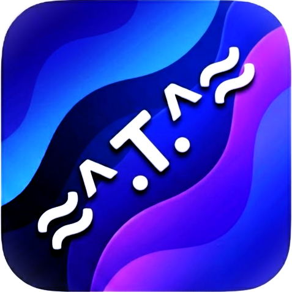
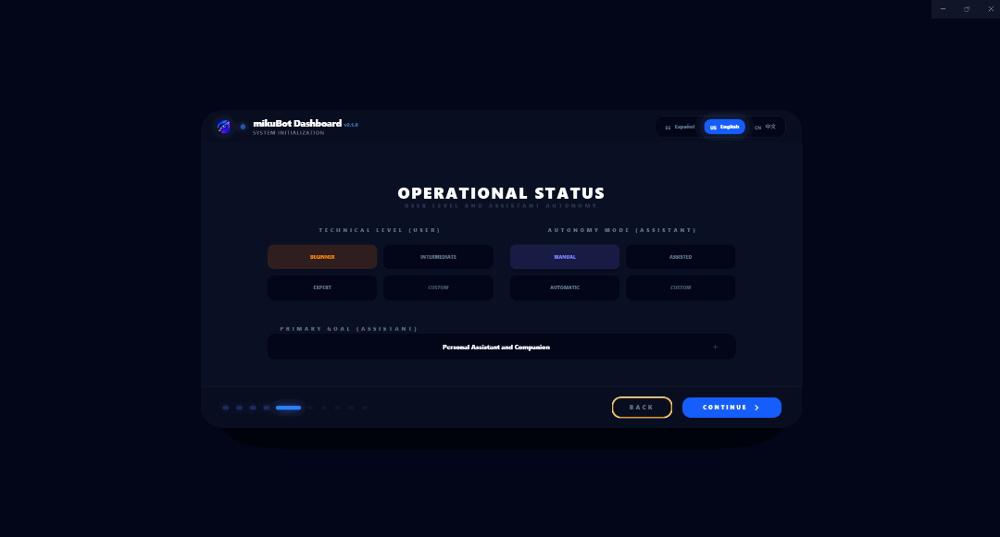
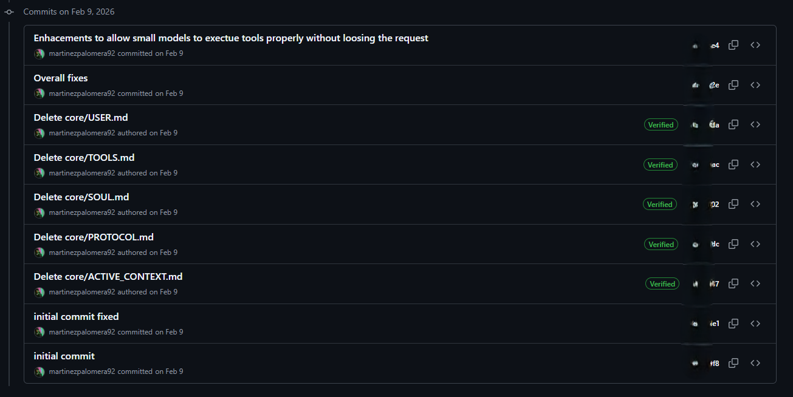
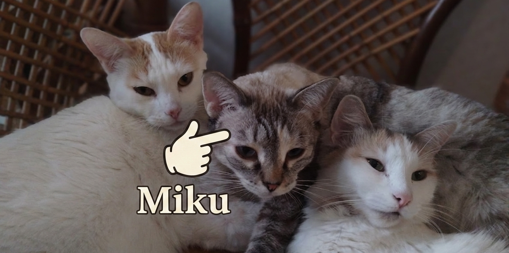

<div align="center">



# 🌟 MikuBot v2.3.0 — The Sovereign Persistence Update


[Español](README.md) | [中文](README.zh.md)

<br/>

<a href="https://github.com/NeuralArchLabs/mikuCentralv1.0">
  
</a>

<br/>

<a href="https://github.com/NeuralArchLabs/mikuBot/releases/download/v2.3.0/MikuBot-Setup-2.3.0.exe">
  
</a>

<br/>

An AI agent and assistant directed at the general public. Designed as a friendly alternative, easy to install and use compared to more complex tools like OpenClaw, ideal for users without high technical knowledge.

<br/>



</div>

---

## ✨ Main Features

*   **Deep Onboarding and Personalization:** Features an initial configuration process that guides you step-by-step. From the first moment, you can nurture the assistant with all the information you want it to know about you, achieving absolute personalization so it understands exactly your context, needs, and how to help you.
*   **Autonomy and Operation Modes:** Features a Chat Mode and an Agent Mode focused on different types of assistance, both with native tool execution. Choose between a *fully autonomous* mode, a *safe mode* (requires prior authorization), and the creation of **scheduled tasks** for total autonomy.
*   **Persistent & Multi-session Execution (Studio Elite):** Miku no longer stops when switching neural branches. Agents can complete complex tasks autonomously in the background while you interact with other sessions, maintaining a persistent and visually reactive link that notifies you of process status in other branches.
*   **Context Library:** A module that allows you to create, store, and reference protocols and documents to review, improve, or apply with the assistant at any time.
*   **MikuBot Markdown Engine (Studio Elite):** MikuBot integrates a professional-grade rendering engine designed for technological sovereignty and technical precision. This "Studio Elite" suite redefines visual interaction:
    *   **Professional-Grade Scientific Rendering (LaTeX):** High-precision engine for complex mathematics ($$ and $), integrals, matrices, and physical constants. Empowers researchers and students with publication-quality technical reporting.
    *   **Architecture & Data Logic (Mermaid):** Native visualization for flowcharts, GitGraphs, and mindmaps. Eliminates the need for external tools by rendering architecture and logic directly within the chat thread.
    *   **Structured Knowledge Management (Callouts):** Universal Obsidian-style support (`> [!TYPE]`) for organizing instructions, logs, and protocols with 14+ reactive styles and synchronized typing animations.
    *   **Kinetic & Progressive Canvas:** Organic animation system and dynamic typography that synchronizes information reveal with the assistant's real-time reasoning, providing a "living" UI.
    *   **Documentation Integrity (Protection Pipeline):** 3-phase pipeline ensuring that images, links, and nested code blocks maintain perfect structural integrity, regardless of AI data flow complexity.
*   **Neural Editing (Cortex & Command Editors):** MikuBot includes specialized editors to directly modify the assistant's instructions and base knowledge. While you can adjust these files at any time for technical customization, **it is recommended to follow the Onboarding Wizard process** for optimal results. Critical files like `MODES.md` dictate the agent's operating protocols, and manual changes require caution to maintain system stability.
*   **Voice and 24/7 Connectivity:** Includes native voice recognition out-of-the-box (via Vosk) in English and Spanish. Additionally, it allows easy linking with Telegram (via BotFather) to operate 24/7.
*   **100% Multilingual Support (EN/ES/ZH):** Unlike other alternatives on the market that are usually limited to a single language, MikuBot is **fully translated and optimized** to function perfectly in **English, Spanish, and Chinese**. From the interface to the agent's reasoning, the system offers a native and fluid experience in all three languages, providing technical superiority and global usability.
*   **Portability and Backup:** Allows a full memory dump into a compressed file to backup everything, including sessions, personalizations, memory, *skills*, and access keys.
*   **Windows-First Focus:** Programmed in Electron for scalability, but 100% focused on Windows for perfect native integration with **searXena**, with no short-term plans to be ported to other systems.

---

## 🤓 Under the Hood (For Developers and Power Users)

Beneath its friendly interface, MikuBot is a professional-grade autonomous agent execution environment designed for technological sovereignty.

### 🏛️ Origin and Project Integrity
MikuBot is **not a fork of OpenClaw** nor does it reuse any logic from the **Claude Code** (March 31, 2026) leaks. This project is 100% independent, having started in early **February 2026** (see evidence image below) as an effort to optimize Small Language Models (SLMs) for tool execution and agentic tasks.

<div align="center">
  
  <p><i>Snapshot of the very first logical core commits of MikuBot (February 2026).</i></p>
</div>

> [!NOTE]
> For repository history security reasons (preventing accidental leaks of development keys or other sensitive data from the early environment), the code was published to GitHub as a "clean" release at a later date than its actual inception.

Its development was planned and executed under agile methodologies, based strictly on research, trial, and error until reaching its current state. We believe in transparency and proprietary architecture as the foundation of a secure, sovereign system.

### 🧠 Multi-Model Neural Intelligence
- **Ollama:** 100% local and private inference and access to cloud models with a very generous free tier.
- **Google AI:** Massive models with massive context windows, free tier available.
- **Groq:** A wide catalog of models to choose from at reasonable prices.
- **Z.AI (BigModel):** Advanced coding capabilities at an unbeatable price.
- **Neural Flow:** Interface that visually separates internal thought (*Internal Monologue*) from executed technical actions.

### 🛠️ Tool Ecosystem and Security
**Multi-Root File System (`SafePathResolver`):**
- `@WORKSPACE/` — Main project directory.
- `@CORE/` — System logic and base prompts.
- `@LIBRARY/` — Protocols and knowledge bases.
- `@TOOLS/` — Skill blueprints and scripts.

The system includes native tools injected into the LLM such as `read_file`, `smart_patch`, `search_files`, and shell injection protection (`run_console` whitelist).

### 🏆 Why MikuBot? (Competitive Analysis)

MikuBot is not just another AI client; it is an agentic execution environment designed for data sovereignty and technical precision. Below, we compare our approach against other local agents and the most popular web-based clients.

#### 🏛️ Tier 1: Local Autonomous Agents

| Feature / Approach | 🌐 **MikuBot (Our Focus)** | 🦞 **OpenClaw** | 🧠 **memUBot (NevaMind-AI)** |
| :--- | :--- | :--- | :--- |
| **Paradigm & Interface** | **Desktop App (Premium GUI).** Full visual control over reasoning and file management. | **Headless Daemon / Messaging.** Controlled via WhatsApp, Telegram, or CLI (TUI). | **Enterprise Team Bot.** Primarily integrated into Slack, Discord, or Feishu. |
| **Windows Execution** | **100% Native (`.exe`).** Optimized to run directly on the Windows kernel. | **Requires WSL2 (Ubuntu).** Depends on a Linux subsystem and manual bash scripts. | Native / Cross-platform, but heavy server-side architecture. |
| **Learning Curve** | **Instant (Wizard-led).** Step-by-step installation and guided setup for any user. | **High.** Requires deep CLI knowledge and Linux environment configuration. | **Moderate.** Setup geared toward IT departments and enterprise workflows. |
| **Visual Reasoning** | **Neural Flow.** Real-time visual stream of thoughts, tool usage, and states. | **Text Logs.** Raw terminal output without visual internal state representation. | **Standard History.** Conventional chat interface without visual technical breakdown. |
| **Transparency** | **Anti-Black Box.** Ability to inspect system prompts and payloads in real-time. | **Partial Black Box.** Internal prompt logic hidden behind the CLI. | **Closed Proprietary.** Decision logic remains server-private. |
| **Languages (Sovereignty)** | **Universal (ES/EN/ZH).** Absolute feature and reasoning parity in 3 languages. | **EN-Centric.** Optimized support almost exclusively for the English language. | **EN-Centric.** Limited multilingual support. |

#### ☁️ Tier 2: Web-Based AI Clients

| Feature | 🌐 **MikuBot (Local Gateway)** | 🤖 **ChatGPT / Gemini / Perplexity** |
| :--- | :--- | :--- |
| **Data Access** | **Deep Context.** Direct access to your file system (@WORKSPACE) and local assets. | **Web Sandbox.** Limited to manually uploaded files or generic web search. |
| **Tool Execution** | **Total Sovereignty.** Native execution of Python, SearXena, and scripts with no middlemen. | **Restricted Cloud.** Code execution in isolated, remote servers with limited permissions. |
| **Precision & Info** | **Personalized Attention.** Prioritizes your files and tools to avoid suppositions. | **Hallucination Prone.** May guess data if the web search is insufficient. |
| **Privacy & Control** | **You are the Owner.** Data stays yours; you choose the provider and what to share. | **Closed Ecosystem.** Your data is often used to train the provider's future models. |
| **Visualization** | **Studio Elite.** Scientific-grade high-fidelity rendering of LaTeX, Mermaid, and Callouts. | **Basic Markdown.** Standard browser visualization with low technical flexibility. |

#### 🚀 The MikuBot Edge: The 4 Pillars of Excellence

1.  **Native Performance:** No translation layers or virtualization; Miku speaks your PC’s language for minimum latency.
2.  **Precision and Personalization (Powered by [searXena](https://github.com/NeuralArchLabs/searXena)):** No guessing. Miku consults your files and leverages the **searXena** sovereign metasearch engine (developed natively by us) before responding, ensuring exact, updated results.
3.  **Absolute Transparency (Anti-Black Box):** You have full control. Every model decision, prompt, and data byte is auditable in real-time.
4.  **Provider Freedom:** Switch brains (Ollama, Gemini, Groq, Z.AI) in seconds without losing your workflow. Miku is your universal sovereign interface.

### 💻 Tech Stack
| Component | Technology |
| :--- | :--- |
| **Frontend** | React 19 + TypeScript |
| **Styling** | Vanilla CSS + Tailwind CSS 4.1 |
| **Desktop Runtime** | Electron 40.2 (Native Node.js integration) |
| **Build Tool** | Vite 6.2 |
| **State Management** | Zustand 5.0 |
| **Inference** | Google GenAI SDK, fetch-proxy for Ollama, OpenAI-compatible |

### 🚀 Local Installation and Development
```bash
# 1. Clone this repository
git clone https://github.com/NeuralArchLabs/mikuBot.git
cd mikuBot

# 2. Install dependencies
npm install

# 3. Run in Development mode (with Electron HMR)
npm run electron:dev

```

### ⚖️ License and Open Source Attributions
This project is distributed under the **GNU Affero General Public License v3.0 (AGPL-3.0)**. If you modify this program and offer it as a network service, you must make the source code available to your users.

**Third-Party Acknowledgments:**
MikuBot is made possible thanks to open-source technologies like React (MIT), Vite (MIT), Electron (MIT), Mermaid.js (MIT), Font Awesome Free (CC BY 4.0 / MIT / SIL OFL 1.1), **Outfit Font (SIL OFL 1.1)**, **Vosk Engine (Apache 2.0)**, Tailwind CSS (MIT), Zustand (MIT), i18next (MIT), unzipper (MIT), FastAPI (MIT), and AI SDKs like Ollama and Google GenAI (Apache 2.0). Refer to the [`LICENSE`](./LICENSE) file for more details.

**Embedded Python Engine:**
MikuCentral includes Python 3.11.9 embedded as a general engine for all Python-based functionalities (SearXena, voice recognition, skill execution). Python is distributed under the **Python Software Foundation License Version 2**, a permissive license that allows its use in proprietary software without an open-source obligation. The package also includes components under MIT (libffi), BSD (bzip2, Tcl/Tk), and Microsoft Distributable Code for Windows licenses. Refer to [`engine/python/LICENSE.txt`](./engine/python/LICENSE.txt) for the complete Python distribution terms.

---

## 🏛️ Credits and Legal Disclaimer
MikuBot is an initiative developed and maintained by [**Neural Arch Labs**](https://github.com/NeuralArchLabs).

**Trademark Notice:** This software uses names, logos, and trademarks of Artificial Intelligence inference providers (such as Google Gemini, Groq, Ollama, Z.AI, among others) strictly for referential and informational purposes oriented toward end-user navigation. **[Neural Arch Labs](https://github.com/NeuralArchLabs) does not own the rights to these logos or tradenames**, has no official affiliation or sponsorship from said entities, and does not obtain any gain, profit, or economic benefit derived from their use or inclusion in the interface. MikuBot acts solely as a neutral client (tool) for the user to consume services via their own configurations.

🤝 **Collaborations and Sponsorships:** We are an independent laboratory committed to open-source technology and digital sovereignty. We are fully open to corporate collaborations, official integrations, and external sponsorships. If you represent an AI provider or wish to financially support the continuous development of MikuBot, feel free to contact us!

---

## 🐾 The Origin of Our Name

It's common to think that **MikuBot** takes its name from the well-known virtual idol *Hatsune Miku*. However, the origin is personal. This project was named after **Miku** (the kitten in the middle of the photo), who I rescued along with her two siblings. Since then she has been with me and always stays by my side while I am programming.

<div align="center">
  
  <p><i>From left to right: Zanahorio, Miku, and Freya.</i></p>
</div>

MikuBot is simply an acknowledgment of her unconditional company in the lab.

---
*Developed with precision by [Neural Arch Labs](https://github.com/NeuralArchLabs).*
